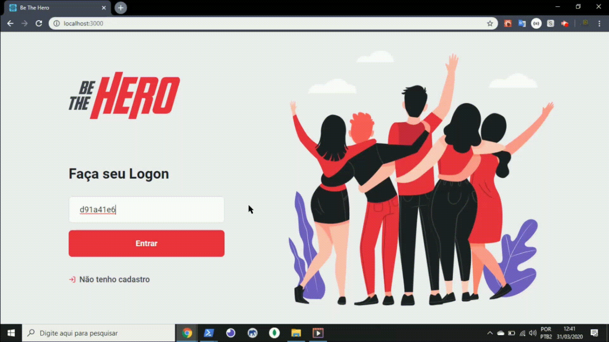

<h3 align="center">

  
  
 Make the World a Better Place
</h3>

## What is it?

Be The Hero is an application developed where people manage to make donations to NGOs who need

 

<h1 align="center">
 
</h1>

 

<h1 align="center">
 
</h1>

## Technologies used

* 💹 Node Js — A web framework for Node Js
* ⚛️ React Js — A JavaScript library for building user interfaces
* ⚛️ React Native — A lib that provides a way to create native apps for Android and iOS (With Expo)
* 📄 SQLite3 — A C language library that implements an embedded SQL database
* ⚓ Knex.js - A SQL query builder for Javascript

## How to Use?

1. Clone this repository: `git clone https://github.com/KauaLimaMartins/DevRadar.git`

2. Move yourself to the folder: `cd be-th-hero`

## How to Use the Backend?

1. Move yourself to the backend folder: `cd backend`

2. Install all libs: `yarn`

3. Run: `yarn dev`

## How to Use the Web?

1. Move yourself to the web folder: `cd frontend`

2. Install all libs: `yarn`

3. run: `yarn start`

## How to Use the Mobile?

1. Move yourself to the mobile folder: `cd mobile`

2. Install all libs: `yarn`

3. Run: `yarn start`

4. install the "expo" app from your phone's app store

5. Scan the qr code that appeared on your computer

## What if i use Emulator?

1. Move yourself to the mobile folder: `cd mobile`

2. Install all libs: `yarn`

3. Run: `yarn start`

4. Click on the "Run on (IOS or Android) Simulator" button on the left
